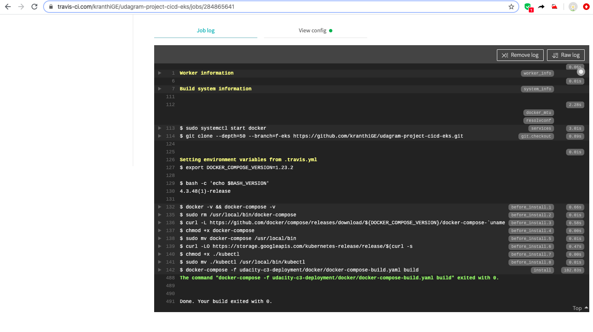
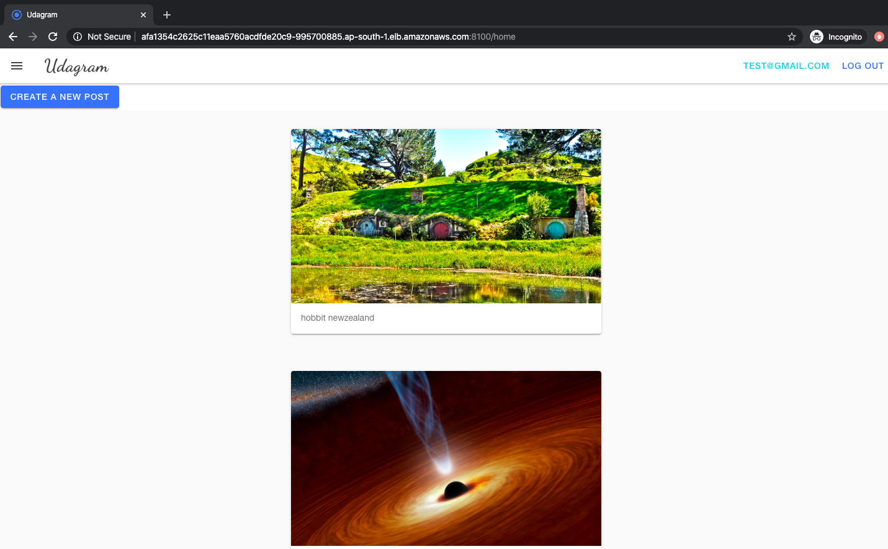

# Udagram Image Filtering Microservice

Author: Kranthi Kiran  
Created On: 02-Feb-2020  

Udagram is a simple cloud application developed alongside the Udacity Cloud Engineering Nanodegree. It allows users to register and log into a web client, post photos to the feed, and process photos using an image filtering microservice.

The project is split into three parts:
1. [The Simple Frontend](/udacity-c3-frontend)
A basic Ionic client web application which consumes the RestAPI Backend. 
2. [The RestAPI Feed Backend](/udacity-c3-restapi-feed), a Node-Express feed microservice.
3. [The RestAPI User Backend](/udacity-c3-restapi-user), a Node-Express user microservice.

## Deployment and running
***********

Docker Images have been built and deployed on EKS. Travis CI also has been setup to build the images.
These images are pushed to public docker hub and from there the EKS PODs are built using deployment yaml files.
 
Application URL: http://afa1354c2625c11eaa5760acdfde20c9-995700885.ap-south-1.elb.amazonaws.com:8100 

Travic CI successful build: https://travis-ci.com/kranthiGE/udagram-project-cicd-eks 


Screen shot of the application: 


### Docker images
```
  docker pull kranthikirana/udacity-restapi-feed  
  docker pull kranthikirana/udacity-restapi-user  
  docker pull kranthikirana/udacity-frontend  
  docker pull kranthikirana/reverseproxy  
```

## Getting Setup

> _tip_: this frontend is designed to work with the RestAPI backends). It is recommended you stand up the backend first, test using Postman, and then the frontend should integrate.

### Installing Node and NPM
This project depends on Nodejs and Node Package Manager (NPM). Before continuing, you must download and install Node (NPM is included) from [https://nodejs.com/en/download](https://nodejs.org/en/download/).

### Installing Ionic Cli
The Ionic Command Line Interface is required to serve and build the frontend. Instructions for installing the CLI can be found in the [Ionic Framework Docs](https://ionicframework.com/docs/installation/cli).

### Installing project dependencies

This project uses NPM to manage software dependencies. NPM Relies on the package.json file located in the root of this repository. After cloning, open your terminal and run:
```bash
npm install
```
>_tip_: **npm i** is shorthand for **npm install**

### Setup Backend Node Environment
You'll need to create a new node server. Open a new terminal within the project directory and run:
1. Initialize a new project: `npm init`
2. Install express: `npm i express --save`
3. Install typescript dependencies: `npm i ts-node-dev tslint typescript  @types/bluebird @types/express @types/node --save-dev`
4. Look at the `package.json` file from the RestAPI repo and copy the `scripts` block into the auto-generated `package.json` in this project. This will allow you to use shorthand commands like `npm run dev`


### Configure The Backend Endpoint
Ionic uses enviornment files located in `./src/enviornments/enviornment.*.ts` to load configuration variables at runtime. By default `environment.ts` is used for development and `enviornment.prod.ts` is used for produciton. The `apiHost` variable should be set to your server url either locally or in the cloud.

***
### Running the Development Server
Ionic CLI provides an easy to use development server to run and autoreload the frontend. This allows you to make quick changes and see them in real time in your browser. To run the development server, open terminal and run:

```bash
ionic serve
```

### Building the Static Frontend Files
Ionic CLI can build the frontend into static HTML/CSS/JavaScript files. These files can be uploaded to a host to be consumed by users on the web. Build artifacts are located in `./www`. To build from source, open terminal and run:
```bash
ionic build
```
***
### steps to create EKS cluster
```
eksctl create cluster \
--name udagram-dev \
--version 1.14 \
--region ap-south-1 \
--profile=eks
```

### commands to run to setup kubernetes
```
kubectl apply -f pod.yaml
kubectl get pod
kubectl get pod -o wide
kubectl logs pod-example
kubectl delete pods pod-example
kubectl apply -f aws-secret.yaml 
kubectl get secret aws-secret
kubectl apply -f env-secret.yaml 
kubectl get secret env-secret
kubectl get secrets
kubectl describe secrets/env-secret
kubectl apply -f env-configmap.yaml 
kubectl get configMap env-config
kubectl apply -f backend-feed-deployment.yaml
kubectl get deployment
kubectl get pod
kubectl logs backend-feed-XXXXXXXX-mdcmz
kubectl describe pods
kubectl delete deployment backend-feed
kubectl get rs
kubectl apply -f reverseproxy-service.yaml 
kubectl apply -f backend-feed-service.yaml
kubectl apply -f backend-user-service.yaml 
kubectl get svc
kubectl apply -f reverseproxy-deployment.yaml 
kubectl scale deployment backend-feed --replicas=0
kubectl scale deployment backend-feed --replicas=3
```

### command to ssh to POD container
```
kubectl exec -it backend-feed-XXXXXXXXXX -- /bin/bash
```
### create a IAM service account
```
eksctl utils associate-iam-oidc-provider --cluster dev --approve --profile=eks
eksctl create iamserviceaccount --name eks-iam-svc --namespace default --cluster dev --attach-policy-arn arn:aws:iam::XXXXXXX:policy/s3-bucket-name --approve --override-existing-serviceaccounts --profile=XXXX
```
